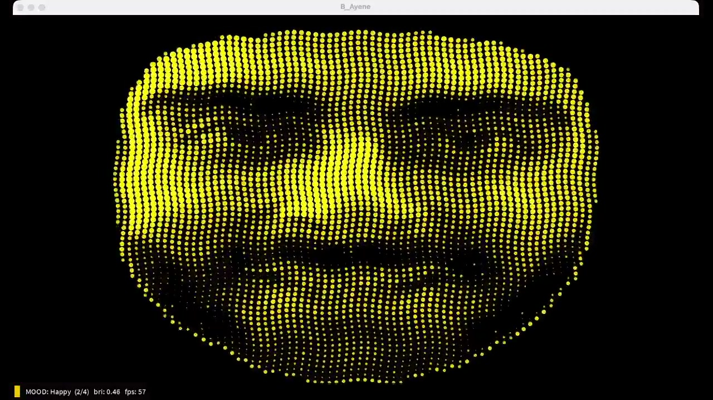

# ayene-matrix

**MOOC badge:** [Acoustics and Multimedia](https://bestr.it/award/show/tx-1z9JSQbCTLCYXVmW_WQ) (Politecnico di Torino, Apr 2026)

**Technical report:** [docs/technical-report.pdf](docs/technical-report.pdf)



A live "mirror" that reads my face and turns it into a dot-matrix portrait.
My face is detected in Python, my expression is classified into a mood by
Wekinator, and the mood changes how the portrait looks in Processing. The
final picture can be streamed locally to a web page.

It is built from two entities that talk only through OSC:

- **Entity A - `a_sense.py`** (Python): reads the webcam, measures my face,
  sends 8 expression numbers to Wekinator.
- **Entity B - `B_Ayene/B_Ayene.pde`** (Processing): draws my face as a grid
  of dots and changes color, motion and shape depending on the mood Wekinator
  sends back.

---

## How the data flows

```
webcam
   |
   v
a_sense.py  (MediaPipe blendshapes -> 8 expression scores + portrait grid)
   |
   |  OSC /wek/inputs   port 6448   \  OSC /ayene/grid  port 12000
   v                                  v
Wekinator  (classifier, 4 moods)     B_Ayene.pde  (dot-matrix face)
   |                                  ^
   |  OSC /wek/outputs  port 12000 --/
   v
OBS  ->  MediaMTX (WHIP/WHEP)  ->  web/index.html
```

| Direction | OSC address | Port |
|-----------|-------------|------|
| a_sense.py to Wekinator | `/wek/inputs` | `6448` |
| a_sense.py to B_Ayene | `/ayene/grid` (byte blob) | `12000` |
| Wekinator to B_Ayene | `/wek/outputs` | `12000` |

---

## macOS camera conflict (problem and solution)

Early on I tried to open the webcam in both Python and Processing. On macOS that
does not work: when `a_sense.py` is running, Processing gets a **black camera
feed**, because only one program can use the built-in camera at a time.

I solved this by keeping the camera in Python only. `a_sense.py` sends a
96×72 brightness grid to `B_Ayene` over OSC (`/ayene/grid` on port `12000`).
Processing draws the portrait from that grid and does **not** open the webcam.
That is why the sketch needs **oscP5** only — no Video library. In the final
setup both programs run together without conflict.

---

## The 4 moods

| Class | Mood | Facial expression | How the dots look |
|-------|------|------------------------|-------------------|
| 1 | Neutral | resting face | cool gray-blue circles, calm |
| 2 | Happy | smile | warm gold circles, small wiggle |
| 3 | Surprised | open mouth, raise eyebrows | cyan pulsing dots (ripple) |
| 4 | Focused | frown / squint | purple squares, sharp and still |

---

## Setup

### 1. Python (Entity A)

Install dependencies once:

```bash
pip install -r requirements.txt
```

Run the sensing script (from inside this project folder):

```bash
python3 a_sense.py
```

A window opens showing your face, the tracked points, the eight feature bars at the
bottom, and the current mood guess at the top. Press `q` to quit.

**Important:** `face_landmarker.task` must be in the **same folder** as
`a_sense.py`. It is included in this repository (~3.6 MB). If Python reports that
the model is missing, check that you cloned or downloaded the complete repository.

### 2. Wekinator

Open **`WekinatorProject/matrix.wekproj`** in Wekinator (File → Open Project).
The project is already trained. Click **Run**.

If you need to retrain, use these settings:

- inputs: **8**, address `/wek/inputs`, port `6448`
- outputs: **1 classifier**, **4 classes**
- output address `/wek/outputs`, port `12000`
- model: **KNN**; the included trained artifact uses **k = 1**. If you
  retrain it, **k = 3** is a useful alternative for a less local vote.

### 3. Processing (Entity B)

Open `B_Ayene/B_Ayene.pde` in Processing 4. Install the **oscP5** library only
(Sketch → Import Library → oscP5). **Video** is not needed — the webcam is
only used in Python. Press Run.

> On macOS, only `a_sense.py` opens the webcam. It also sends a brightness grid
> to `B_Ayene` over OSC (`/ayene/grid` on port 12000), so both programs can run together
> without competing for the camera.

---

## How I train the 4 classes

This step decides whether the demo works, so I keep it simple:

1. Start `a_sense.py`, then start Wekinator (it should show that it is receiving eight
   inputs).
2. In Wekinator, set the output class to **1**, make a **neutral** expression, and
   record for a few seconds. Move your head slightly while recording so the model
   learns that head pose does not matter.
3. Class **2**: hold a **smile**, then record.
4. Class **3**: **open your mouth and raise your eyebrows** (surprised), then record.
5. Class **4**: **frown or squint** (focused), then record.
6. Click **Train**, then **Run**.
7. Open `B_Ayene` and check that each expression changes the picture correctly. If a
   class is weak, record a few more examples for that class and train again.

Tip: while recording each class, move your head slightly (left, right, up or down). The
blendshape scores are already pose-robust, but extra examples make classification smoother.

---

## Streaming to a web page (local, no cloud)

MediaMTX must be installed separately (`brew install mediamtx` or download it
from the official MediaMTX website). Then:

1. Run MediaMTX from this folder: `mediamtx mediamtx.yml`
2. In OBS, add **Window Capture** of the Processing window. Publish with
   **WHIP** to `http://127.0.0.1:8889/live/whip`.
3. Open `web/index.html` in a browser on the same machine.

Use a standard H.264 encoder in OBS (hardware or software), canvas
`1280×720`, 30 fps. No microphone or desktop audio is required.

---

## Repository contents

```
ayene-matrix/
  a_sense.py              Entity A: face sensing + OSC out
  face_landmarker.task    MediaPipe model (required, same folder as a_sense.py)
  requirements.txt        Python packages to pip install
  B_Ayene/B_Ayene.pde     Entity B: dot-matrix visuals
  WekinatorProject/       trained classifier (open matrix.wekproj)
  mediamtx.yml            local WebRTC streaming config
  web/index.html          browser viewer page
  README.md               this file
  docs/preview.jpg        README hero image
  docs/technical-report.pdf
                          detailed project report
```

---

## A note on detection

I first built my own features from raw landmark distances (mouth width,
eyebrow distance...). That was creative and explainable, but it was sensitive
to head movement and needed calibration for each person. For a live
presentation I switched to MediaPipe **blendshapes**, which are expression
scores the model gives directly (0 to 1) and are much more reliable. The
geometric experiment is discussed in the [technical report](docs/technical-report.pdf).
